<p align="center">
  
</p>

## About

Independent researcher working on Windows systems programming and binary analysis. I write small, focused tools that make the layer between source code and the running process visible: object layout, calling conventions, how linkers assemble a binary, how loaders map it, and how debuggers see it.

- **Windows x64 internals:** PE/COFF layout, MSVC RTTI, class recovery, vtable walking
- **Low-level tooling:** binary inspection and runtime observation, mostly in C++ and Rust
- **Lab-first:** everything is built and tested on my own machines, against my own target binaries and harnesses

## Toolbox

<table>
  <tr>
    <td><b>Languages</b></td>
    <td>
      
      
      
      
    </td>
  </tr>
  <tr>
    <td><b>Build</b></td>
    <td>CMake &nbsp;·&nbsp; Cargo &nbsp;·&nbsp; MSVC &nbsp;·&nbsp; MinGW-w64</td>
  </tr>
  <tr>
    <td><b>Analysis</b></td>
    <td>Ghidra &nbsp;·&nbsp; x64dbg &nbsp;·&nbsp; WinDbg</td>
  </tr>
  <tr>
    <td><b>Topics</b></td>
    <td>PE/COFF &nbsp;·&nbsp; MSVC ABI &amp; RTTI &nbsp;·&nbsp; x64 calling conventions &nbsp;·&nbsp; linkers &amp; loaders</td>
  </tr>
</table>

## Projects

A small toolkit for taking x64 Windows binaries apart. `pe-walker` and `pe-diff` cover the file format, `rtti-dump` and `vtable-dump` recover C++ class structure from MSVC builds, and `pattern-scan` is a drop-in library for signature scanning. Every project is C++17, builds with CMake, is MIT-licensed and has zero third-party dependencies.

<table>
  <tr>
    <td width="50%" valign="top">

### [pe-walker](https://github.com/td185721/pe-walker)

Command-line inspector for the Portable Executable format: DOS and NT headers, section layout, imports and exports.

```powershell
pe-walker --summary app.exe
```

<sub><code>PE/COFF</code> &nbsp;<code>CLI</code> &nbsp;<code>x86 / x64</code></sub>

</td>
    <td width="50%" valign="top">

### [pe-diff](https://github.com/td185721/pe-diff)

Structural diff for two PE files. Compares headers, sections, imports and exports, and exits non-zero on drift so it can gate a CI pipeline.

```powershell
pe-diff -T old.dll new.dll
```

<sub><code>PE/COFF</code> &nbsp;<code>CLI</code> &nbsp;<code>patch diffing</code></sub>

</td>
  </tr>
  <tr>
    <td width="50%" valign="top">

### [rtti-dump](https://github.com/td185721/rtti-dump)

Recovers class hierarchies from stripped MSVC x64 binaries by walking Complete Object Locator → Class Hierarchy Descriptor → Base Class Array.

```powershell
rtti-dump --demangle app.exe
```

<sub><code>MSVC RTTI</code> &nbsp;<code>class recovery</code> &nbsp;<code>CLI</code></sub>

</td>
    <td width="50%" valign="top">

### [vtable-dump](https://github.com/td185721/vtable-dump)

Companion to rtti-dump. Finds each class's vtable through its Complete Object Locator back-reference and enumerates the virtual function slots.

```powershell
vtable-dump -f exception app.exe
```

<sub><code>MSVC ABI</code> &nbsp;<code>vtables</code> &nbsp;<code>CLI</code></sub>

</td>
  </tr>
  <tr>
    <td colspan="2" valign="top">

### [pattern-scan](https://github.com/td185721/pattern-scan)

Single-header C++17 library for IDA-style byte signature scanning. Parse a pattern once, then find the first or every match in a byte range. No allocations beyond the parsed signature and no OS-specific code.

```cpp
const auto sig = patscan::parse("48 8B ?? E8 ?? ?? ?? ?? 85 C0");
const auto* hit = patscan::find(data, size, sig);
```

<sub><code>header-only</code> &nbsp;<code>signature scanning</code> &nbsp;<code>library</code></sub>

</td>
  </tr>
</table>

<br>

<p align="center">
  <sub>Built for learning and research. Every tool here is developed and tested against my own target binaries.</sub>
</p>
