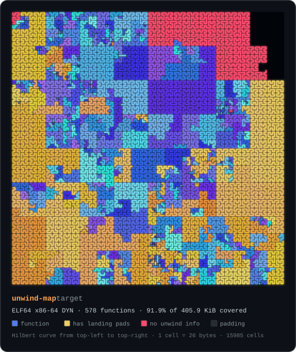

<p align="center">
  
</p>

## About

I'm an independent researcher working on systems programming and binary analysis across **Windows and Linux**. Most of what I build is small, focused tooling that makes the layer between source code and the running process visible: how compilers lay out objects and emit metadata, how linkers assemble a binary, how loaders map it into memory, and how debuggers and unwinders read it back.

I'm most interested in the metadata a compiler *has* to leave in a binary, such as RTTI, vtables, unwind tables and import tables. It survives stripping, and it often reveals more about a program's structure than the symbol table did.

<p align="center">
  
</p>

### What I work on

- **Windows x64 internals:** PE/COFF layout, the MSVC C++ ABI, RTTI and class hierarchy recovery, vtable layout, import and export directories
- **Linux internals:** ELF, the System V AMD64 ABI, DWARF call frame information and `.eh_frame`, program headers and the dynamic loader, `/proc`
- **Reverse engineering tooling:** static analysis that recovers structure from stripped binaries, plus small utilities that fit into Ghidra, GDB, x64dbg and WinDbg workflows
- **Languages:** C++ for Windows tooling, Rust for cross-platform command-line tools, C for the lowest layers, and Python for analysis scripts and test harnesses

### How I work

- **Lab-first:** everything is built and tested on my own machines, against my own target binaries
- **Verified, not eyeballed:** tools are tested against real binaries and, where possible, checked against an independent decoder
- **Small and auditable:** focused codebases with zero third-party dependencies
- **Documented internals:** every README explains the format being parsed, not just the flags

## Toolbox

<table>
  <tr>
    <td><b>Languages</b></td>
    <td>
      
      
      
      
    </td>
  </tr>
  <tr>
    <td><b>Platforms</b></td>
    <td>
      
      
    </td>
  </tr>
  <tr>
    <td><b>Build</b></td>
    <td>CMake &nbsp;·&nbsp; Cargo &nbsp;·&nbsp; MSVC &nbsp;·&nbsp; MinGW-w64 &nbsp;·&nbsp; GCC &nbsp;·&nbsp; Clang / LLD</td>
  </tr>
  <tr>
    <td><b>Analysis</b></td>
    <td>Ghidra &nbsp;·&nbsp; x64dbg &nbsp;·&nbsp; WinDbg &nbsp;·&nbsp; GDB &nbsp;·&nbsp; readelf / objdump</td>
  </tr>
  <tr>
    <td><b>Formats &amp; ABIs</b></td>
    <td>PE/COFF &nbsp;·&nbsp; ELF &nbsp;·&nbsp; DWARF CFI &nbsp;·&nbsp; MSVC C++ ABI &nbsp;·&nbsp; System V AMD64 &nbsp;·&nbsp; Microsoft x64 calling convention</td>
  </tr>
</table>

## Projects

Two small toolkits for taking binaries apart, one for each binary format. The PE tools are C++17 with CMake, and they build and run on Windows, Linux and macOS. The ELF tooling is Rust. Everything is MIT-licensed, tested in CI, and has zero third-party dependencies.

<table>
  <tr>
    <td colspan="2" valign="top">

### [unwind-map](https://github.com/td185721/unwind-map)

Recovers function boundaries from **stripped** Linux ELF binaries by decoding the `.eh_frame` unwind tables that `strip` can't remove. It still works when the section headers are gone, flags functions with exception handling, finds code that has no unwind info, puts symbols back with `objcopy`, exports to Ghidra and JSON, and draws the whole binary as a Hilbert-curve map. Checked against `llvm-readobj`'s independent decoder, it produced zero false starts and recovered every function with unwind info on x86-64, x86 and AArch64.

<p align="center">
  
  
</p>

<sub><code>Linux</code> &nbsp;<code>Rust</code> &nbsp;<code>ELF</code> &nbsp;<code>DWARF CFI</code> &nbsp;<code>x86-64 · x86 · AArch64</code> &nbsp;<code>CI-tested</code></sub>

</td>
  </tr>
  <tr>
    <td width="50%" valign="top">

### [pe-walker](https://github.com/td185721/pe-walker)

Command-line inspector for the Portable Executable format: DOS and NT headers, section layout, imports and exports.

```powershell
pe-walker --summary app.exe
```

<sub><code>Windows</code> &nbsp;<code>C++17</code> &nbsp;<code>PE/COFF</code> &nbsp;<code>x86 / x64</code></sub>

</td>
    <td width="50%" valign="top">

### [pe-diff](https://github.com/td185721/pe-diff)

Structural diff for two PE files. Compares headers, sections, imports and exports, and exits non-zero on drift so it can gate a CI pipeline.

```powershell
pe-diff -T old.dll new.dll
```

<sub><code>Windows</code> &nbsp;<code>C++17</code> &nbsp;<code>PE/COFF</code> &nbsp;<code>patch diffing</code></sub>

</td>
  </tr>
  <tr>
    <td width="50%" valign="top">

### [rtti-dump](https://github.com/td185721/rtti-dump)

Recovers class hierarchies from stripped MSVC x64 binaries by walking Complete Object Locator → Class Hierarchy Descriptor → Base Class Array.

```powershell
rtti-dump --demangle app.exe
```

<sub><code>Windows</code> &nbsp;<code>C++17</code> &nbsp;<code>MSVC RTTI</code> &nbsp;<code>class recovery</code></sub>

</td>
    <td width="50%" valign="top">

### [vtable-dump](https://github.com/td185721/vtable-dump)

Companion to rtti-dump. Finds each class's vtable through its Complete Object Locator back-reference and enumerates the virtual function slots.

```powershell
vtable-dump -f exception app.exe
```

<sub><code>Windows</code> &nbsp;<code>C++17</code> &nbsp;<code>MSVC ABI</code> &nbsp;<code>vtables</code></sub>

</td>
  </tr>
  <tr>
    <td colspan="2" valign="top">

### [pattern-scan](https://github.com/td185721/pattern-scan)

Single-header C++17 library for IDA-style byte signature scanning. Candidates are found with `memchr` and filtered before the full compare, about 11× faster than a byte-by-byte scan, and a randomized test checks every result against a reference scanner.

```cpp
const auto sig = patscan::parse("48 8B ?? E8 ?? ?? ?? ?? 85 C0");
const auto* hit = patscan::find(data, size, sig);
```

<sub><code>cross-platform</code> &nbsp;<code>C++17</code> &nbsp;<code>header-only</code> &nbsp;<code>signature scanning</code></sub>

</td>
  </tr>
</table>

<br>

<p align="center">
  <sub>Built for learning and research. Every tool here is developed and tested against my own target binaries.</sub>
</p>
